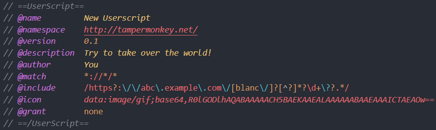
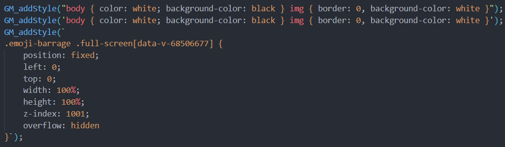
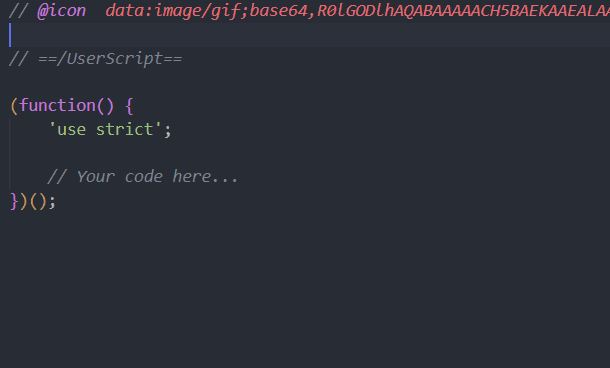
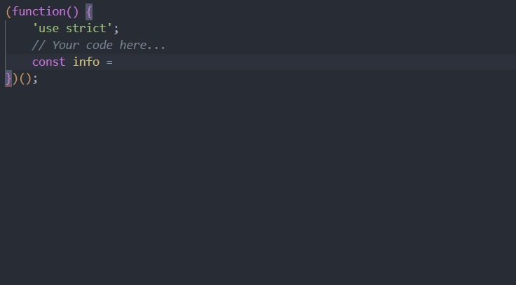
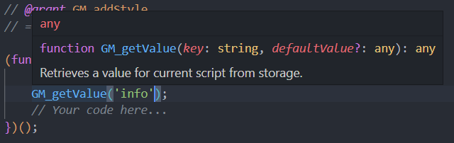
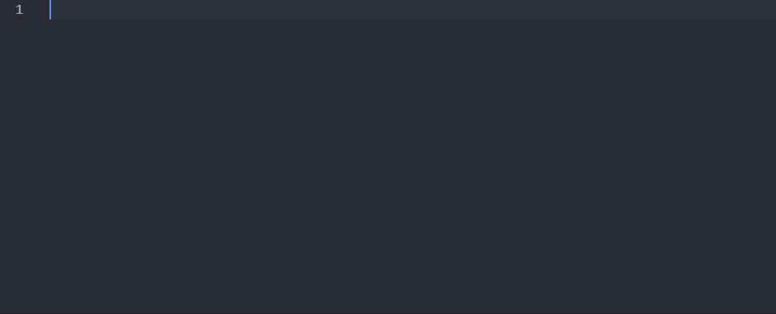

# Scriptmonkey

A simple userscript language support extension which provides syntax highlight, completion, hover, and code snippets.

## Features

### Syntax highlight

- **Metadata**

- **Css in GM_addstyle**

### Completion

- **Metadata**

- **Code**

### Hover

### Code Snippets

Type `userscript` to generate a userscript template. You can modify the default values of some meta data keys in the extension settings.

## Release Notes

Please check [CHANGELOG](CHANGELOG.md).

## License

## Special Thanks

- [kufii](https://github.com/kufii): The metadata highlight feature of Scriptmonkey is improved from [vscode-userscript](https://github.com/kufii/vscode-userscript).
